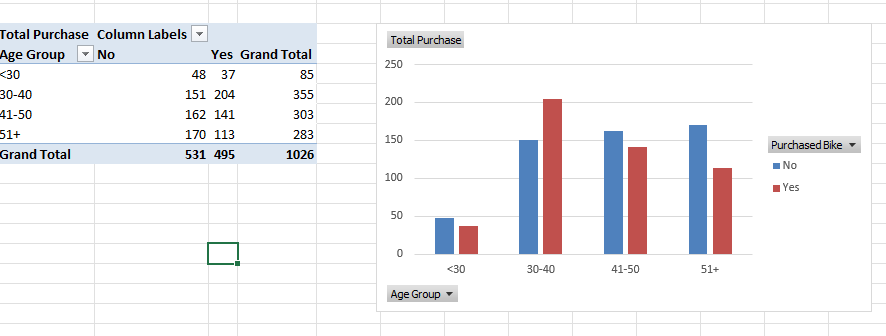

# Bike-Sales-Analysis
Analyzed bike sales data in Excel to track trends, pricing, and customer preferences. Built an interactive dashboard using pivot tables, charts, and conditional formatting, providing clear insights to streamline reporting and support data-driven business decisions.

## Project Description
The Bike Sales Analysis project is an Excel-based analysis aimed at understanding sales performance, pricing trends, and customer preferences. Raw sales data was cleaned and structured to provide accurate insights. An interactive Excel dashboard was built to visualize trends and support data-driven business decisions.

## Tools Used
- Excel (Pivot Tables, Charts, Conditional Formatting)

## Key Insights / Outcomes
- Tracked top-selling bike models and regions.
- Analyzed pricing trends and customer preferences.
- Streamlined reporting for faster decision-making.
- Converted complex datasets into clear, actionable visual insights.

## Screenshots

